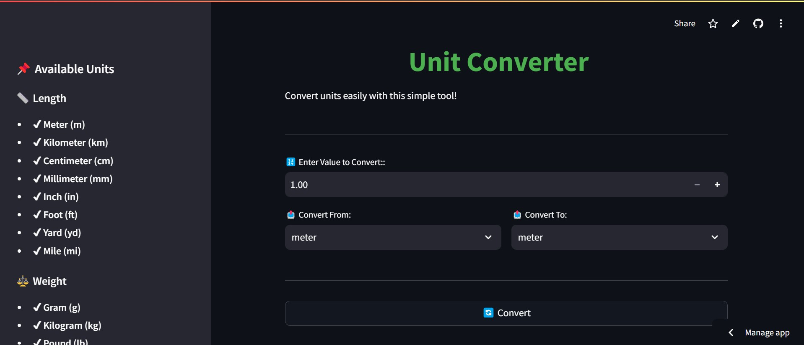

# 📏 Unit Converter App

A simple and interactive **Unit Converter** built with **Streamlit** to easily convert between different measurement units.

## 🚀 Features

✅ Supports conversions for:
- **Length** (Meter, Kilometer, Centimeter, Millimeter, Inch, Foot, Yard, Mile)
- **Weight** (Gram, Kilogram, Pound, Ounce)
- **Temperature** (Celsius, Fahrenheit)

✅ User-friendly **Graphical Interface**
✅ **Real-time conversions** with instant results
✅ **Sidebar navigation** for available units
✅ **Responsive design** for any device

---

## 🛠️ Installation & Setup

Follow these steps to run the app on your local machine:

### 1️⃣ Clone the Repository
```bash
git clone https://github.com/codewithshabbir/unit-converter-python.git
cd unit-converter-python
```

### 2️⃣ Install Dependencies
```bash
pip install -r requirements.txt
```

### 3️⃣ Run the App
```bash
streamlit run app.py
```

---

## 🌐 Live Demo
[**🚀 Try it Live**](https://unit-converter-codewithshabbir.streamlit.app/)

---

## 🎯 Screenshots


---

## 👨‍💻 Developer
Made with ❤️ by **[Muhammad Shabbir](https://codewithshabbir.vercel.app/)**

📌 **GitHub:** [@codewithshabbir](https://github.com/codewithshabbir)  
📌 **Portfolio:** [codewithshabbir.vercel.app](https://codewithshabbir.vercel.app/)

---

## 📜 License
This project is open-source and available under the **MIT License**.